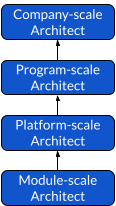

# Architecture path

## Path breakdown

The Architecture path is somewhat special as most people do not think of themselves as architects at first glance.

But the word Architect simply means: __Lead (ἀρχι - archi) Builder (τέκτων - téktōn)__.

The _τέκτων_ part can actually be interpreted in many ways itself:
- carpenter, builder
- crafter, master of art (e.g. woodworking, gymnastics, poetry, medicine, engineering...)
- author, creator, planner

Bottom line, an architect is leading construction / creative / transformative work, which involves mapping, designing and decision making.
If there is nothing to build or change, then architects are not needed!

In our industry, we can meet architects of different types:
- Digital transformations
- Organizations
- Softwares
- Data
- Businesses
- Enterprise IT
- ...

But all these types of architects share the same fundamental abilities:
- Ability to map / draw blueprints of current states and principles of workable systems
- Ability to provide options for "better" states or principles
- Ability to draw clear trajectories towards targeted states or principles
- Ability to assess the potential "rate of change" of the built systems

In order to grow in that path, we designed 4 different scales we thought relevant for any type of architect:
- __Module__: focus on designing modules - supposedly functioning independently with limited external constraints (e.g. a house)
- __Platform__: focus on designing platforms - facilitating the assembly of heterogenous units (e.g. a city)
- __Program__: focus on rationalizing programs - defining principles for systems creations and adaptations (e.g. a urban agglomeration)
- __Company__: focus on (re)defining companies - inducing a sustainable culture to create and adapt systems aligned with the companies' values (e.g. a cultural area)

An Enterprise Architect is therefore not necessarily at the level of a Company-scale Architect.
If they only draw trajectories that fit management requirements without taking into accounts engineering constraints, they may still function as Module-scale Architects.

## Overview

### Steps overview

### Solution-focused Builder

Architects use methodic approaches to construction work by mapping, designing and making impactful decisions at different scales.

They can grow in this path by:
- Modeling and implementing complex systems (e.g. organizations, softwares, relationships...)
- Thinking outside the box for options
- Proactively assessing the potential for sustainability / rate of change of their constructions

## Steps Details

### Module-scale Architect

Module-scale Architects are builders of independent "whole" units.
They design and tailor standalone systems that can exist / function with few external dependencies.

Module-scale Architects usually have 2+ years of experience in building systems.
They also showcase the following:
- Knowledge on the domain involved in building the module
- Good written communication skills (e.g. drawing diagrams)
- Ability to rely on proven patterns to secure the module lifecycle
- Ability to provide necessary requirements to implement module (technical / methodological skills, interface prerequisites, dependencies...)

### Platform-scale Architect

Platform-scale Architects are builders of frames for units integration.
They facilitate the assembly of heterogenous units with different needs towards a clearly sought outcome.

Module-scale Architects usually have 5+ years of experience in building systems.
They also showcase the following:
- Knowledgeable on the different stakes involved by the sought outcome
- Good system thinking
- Ability to formalize architecture decisions and clarify their implications
- Good written and oral communication skills
- Good knowledge of integration patterns (interface definitions, sync / async integration flows, collaborative flows...)

### Program-scale Architect

Program-scale Architects are patterns seekers.
They rationalize constructions to quicken decision making and change management.

Module-scale Architects usually have 8+ years of experience in building systems.
They also showcase the following:
- Expertise on trends and best practices
- Ability to rationalize integrated units within a certain context
- Ability to control architecture decisions implications
- Good knowledge of constructions surrounding aspects (maintainability, dependability, efficiency, usability, sustainability...)

### Company-scale Architect

Company-scale Architects are culture builders.
They align constructions with the company's values.

Company-scale Architects usually have 12+ years of experience in building systems.
They also showcase the following:
- Ability to document and realign complicated systems
- Ability to translate a company’s goals into a proper set up
- Ability to clearly define a set of actions and requirements to migrate from an architecture to another
- Ability to assess architecture decisions implications for all stakeholders
- Ability to discuss with any kinds of stakeholder

[🏠Go Back](../README.md)