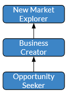

# Business path

The business path focuses on our ability to satisfy our interlocutor needs.

The objective is not to sell all the items in the shop to someone. It is rather to be a good "personnal advisor", in order to go beyond the _demand_, to be able to understand the real _need_, or even to anticipate the _future needs_ based on our experiences or our market knowledge.

## Path breakdown

All types of businesspersons share common fundamental abilities:
- Ability to listen to needs
- Ability to extract actual needs from demands
- Ability to anticipate needs within a situation
- Ability to transpose knowledge from another domain to our iterlocutors' contexts

In order to grow in that path, we designed 3 different levels we thought relevant for any type of Business person:
- __Opportunity seeker__: is able to listen to the demand and satisfy it
- __Business Creator__: is able to analyze the demand and satisfy the underlying need
- __Business Developer__: is able to developp a set of demands and to satisfy the needs according to the customer capacity.
- __New Market Explorer__: is able to anticipate the demand and create a new need

## Overview

### Steps overview

### Dedicated servant

As stated above, the main objectve is not to sell an encyclopedia to the grand'ma in your neighbourhood.
It is to best answer the need of your interlocutor and, depending on your level, to either:
- directly address it
- reassess it
- look beyond it

Let's go over an example.

You work with your friend, lunch time is coming. They tell you: "I want a pizza".

If you answer their _demand_, you call the pizzeria to order one.

If you focus on their _need_, have lunch or eat something, you can either check if they will accept something else (Indian, Mexican) or go deeper into the requirement: "Do you want a drink and an icecream in addition to that?".

If you anticipate _future needs_: "Let's go for the pizza. But, you know, what about doing sports as well? It will not be very healthy to eat pizzas every day." This is based on your experience of delivering pizzas to thousands of persons.

## Steps details

### Opportunity seeker

Persons may be afraid of "selling" something. However, the key objective here is to help our interlocutor, sometimes even without immediate benefit.

The key abilities of an Opportunity Seeker are:
- Ability to understand the demand
- Ability to convert the demand to an answer

### Business Creator

Sometimes, people may have the feeling to try to sell _all the shop_ to the interlocutor.
This is, again, not the aim. the objective is to satisfy the customer's need, to be able to go beyond their demand and to understand their real need.
Product owners are used to saying "customers have difficulties to clearly express their needs: they often focus on a specific demand or detail".

The key abilities of a Business Creator are:
- Ability to go over the demand to identify the real needs
- Ability to validate the identified needs
- Ability to question the expression of the need

### Business Developer

When we meet a requirement we tends to satisfy it the "perfect" way. Satisfying it according the proper cost is a key point.
Also, being able to cover a large scope of needs/topic is important to help the customer globally and not only on a specific area.

The key abilities of a Business Developer are:
- Ability to go over the demand to identify the real needs
- Ability to provide a "Design to cost" solution
- Ability to help on a large scope

### New Market Explorer

Sometimes, people are stuck in a particular domain. They are not able to transpose what happens in other domains to their own context.
_New Market Explorers_ are persons with the ability to extrapolate to other domains.
They are also persons who can innovate within a contextual domain.
Both aspects are equally important.

The key abilities of a New Market Explorer are :
- Ability to extrapolate and/or correlate needs across different domains
- Ability to explain why an out-of-band solution can be suitable in a given context

[🏠Go Back](../README.md)
