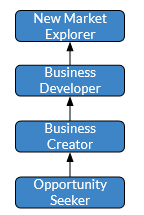

# Business path

The business path focus on our ability to satisfy our interlocutor needs.  The objective is not to sell all the shop to someone. The objective is to be a good 'personnal advisor', in order to go beyond the _demand_, to be able to understand the real _need_, or even to anticipate the _future needs_ based on our experiences, or regarding our market knowledge.

## Path breakdown

But all these types of architects share the same fundamental abilities:
- Ability to listen the needs
- Ability to extract the needs from the demand.
- Ability to anticipage the needs regarding a situation
- Ability to transpose a knowledge from another domain, to our iterlocutor context.

In order to grow in that path, we designed 3 different scales we thought relevant for any type of Busines:
- __Opportunity seeker__: is able to listen the demand, and to satisfy it
- __Business Creator__: is able to go over the demand, to satisfy the need
- __New Market Explorer__: is able to anticipate over the demand, and to create a new need to the interlocutor

## Overview

### Steps overview

### Personified Moving Motivator

As I said, the main objectve is not to sell an encyclopaedia to the grand'ma in your neighbourhoud.
The main objective is to answer the need of your interlocutor, you do your best, and depending of your level you answer either directly to the demand, you are able to identify the need, or even you are able to go beyond.
Let's go throug an exemple.
You work with your friend, lunch time is comming. He tells you 'I want a pizza'.

If you answer to his _demand_, you call the pizza to order one.

If you go to the _need_ : have a lunch, eat something , you can either check if he will accept something else (indian, mexican) or go deeper in the requierement, 'do you want a drink, an icecream in additin' ?

If you anticipate _future needs_ : let's go for the pizza, but you know, what's about doing some sport also ? it will not be very healthy to eat pizza every day. This is based on your experience of delivering pizza to thousand of personn.

## Steps details

### Solution-focused Builder

Usually, personn may be afraid of 'selling' something. Despite the name, the key objective is to help our interlocutor, sometime without even immediate benefice.

The key abilities are :
- Ability to understand the demand
- Ability to convert the demand to an answer

### Opportunity seeker

Sometime people may have the feeling to try to sell _all the shop_ to the interlocutor. This is not the aim, the objective is to satisfy the customer need. To be able to go beyond his demand, to understand the real need.
Product owner, will say customer have difficulties to express clearly their needs, the often focus on a demand, a detail.

The key abilities are :
- ability to go over the demand to identify the real needs
- ability to validate the needs identified
- ability to questionnate to identify the need

### Business Creator

Sometime people are stick in a domain. They are not able to translate what's happening in order domain in their context.
_Business creator_ are person that have the ability to extrapolate between two domains. They are also personn that can inovate in a domain. The two aspects are important.

The key abilities are :
- ability to extrapolate / corrolate needs among demoralization,--isation
- ability to explain why a solution can be suitable in a context

[🏠Go Back](../README.md)