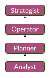

# Delivery path

## Path breakdown

The Delivery path is about supplying - or giving birth to - desired outputs or outcomes.

Delivering relies on the orchestration of strategic decisions and tactical actions.
- Tactics provide contextual proofs of feasibility for strategies
- Strategies allow for quicker and more impactful tactical decisions

When we designed that path's steps, we drew some inspiration from project and product management:
1. __Analyst__: focus on intelligence
2. __Planner__: focus on contingencies
3. __Operator__: focus on execution
4. __Strategist__: focus on optimization

The progression steps came in that particular order since we believe that:
- A Strategist can optimize execution only if they know about the perception of things on the field
- An Operator can execute with unforeseen constraints only if they can plan in real-time
- A Planner can plan ahead only if they can qualify good intelligence

On a side note, we also found out that people performing in that particular path are usually:
- __Driven__ with a solution-focused mindset
- __Adaptable__ to fast change with real-time analysis reflexes
- __People-oriented__ with a conflict-solving attitude

## Overview

### Steps overview

### Production optimizer

Delivery contributors usually have a knack for being disciplined and resilient.
They are solution-focused achievers with a heightened sense of prioritization and accountability.

They can grow in this path by:
- Conceptualizing interactions between people / systems to "take the paths of least resistance"
- Exploring best setups of agreements and engagements
- Aligning stakeholders expectations and contributions

## Steps Details

### Analyst

Analysts are seekers of actionable intelligence.
They can clearly formalize objectives requirements within a delivery context.

Analysts usually have 1+ years of experience as contributors to deliveries.
They also demonstrate the following:
- Ability to detect and explain logical flaws in predefined targets
- Ability to formalize problems in a rigorous and comprehensive manner (e.g. w/ diagrams…)
- Ability to analyze the impact of enhancing a system
- Ability to extract information from raw intelligence

### Planner

Planners are contingencies explorers and risk assessors.
They do not necessarily set "deadlines" but, given a context, they split, frame or scope the necessary progress towards sought outcomes.

Planners usually have 2+ years of experience as contributors to deliveries.
They also showcase the following:
- Ability to guide and assess data analysis works
- Ability to set up objectives and environments to reach predefined targets (e.g. SLO, SLA, SLI)
- Ability to plan achievement milestones
- Ability to propose different delivery setups adapted to a context

### Operator

Operators are field orchestrators with a reactive behaviour.
They are able to prioritize targeted milestones in real-time even when difficulties arise.

Operators usually have 4+ years of experience as contributors to deliveries.
They also showcase the following:
- Ability to lead, monitor and adjust the execution of the delivery (e.g. with KPIs)
- Ability to be committed to achievable results
- Ability to manage contractual crisis
- Ability to adapt the collaboration flow (e.g. producers, consumers, accountabilities…)
- Ability to manage and maintain a backlog of tactical actions

### Strategist

Strategists are proactive system thinkers who can define delivery archetypes for smoother execution.
They are able to abstract out complex / complicated delivery setups, which facilites the selection of adequate archetypes in real-time.

Strategists usually have +8 years of experience as contributors to deliveries.
They also showcase the following:
- Ability to set up and follow up on objectives and key results (OKRs)
- Ability to detect and act on opportunities
- Ability to align field execution with a driving ambition
- Ability to define and monitor strategies declined from the ambition
- Ability to tailor execution models

[🏠Go Back](../README.md)