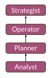

# Chemin de livraison

## Répartition du chemin

Le chemin de livraison consiste à fournir - ou à donner naissance - aux extrants ou aux résultats souhaités.

La livraison repose sur l'orchestration des décisions stratégiques et des actions tactiques.
- Les tactiques fournissent des preuves contextuelles de la faisabilité des stratégies
- Les stratégies permettent des décisions tactiques plus rapides et plus percutantes

Lorsque nous avons conçu les étapes de ce parcours, nous nous sommes inspirés de la gestion de projet et de produit :
1. __Analyste__ : concentrez-vous sur l'intelligence
2. __Planner__ : se concentrer sur les imprévus
3. __Opérateur__ : focus sur l'exécution
4. __Stratège__ : focus sur l'optimisation

Les étapes de progression sont venues dans cet ordre particulier puisque nous pensons que :
- Un stratège ne peut optimiser l'exécution que s'il connaît la perception des choses sur le terrain
- Un Opérateur ne peut exécuter avec des contraintes imprévues que s'il peut planifier en temps réel
- Un planificateur ne peut planifier à l'avance que s'il peut qualifier une bonne intelligence

En passant, nous avons également découvert que les personnes qui se produisent dans ce chemin particulier sont généralement :
- __Driven__ avec un état d'esprit axé sur les solutions
- __Adaptable__ au changement rapide avec des réflexes d'analyse en temps réel
- __Orienté vers les personnes__ avec une attitude de résolution de conflits

## Aperçu

### Présentation des étapes

### Optimiseur de production

Les contributeurs à la livraison ont généralement le don d'être disciplinés et résilients.
Ce sont des performants axés sur les solutions avec un sens accru de la priorisation et de la responsabilité.

Ils peuvent grandir dans cette voie en :
- Conceptualiser les interactions entre personnes/systèmes pour « emprunter les chemins de moindre résistance »
- Explorer les meilleures configurations d'accords et d'engagements
- Aligner les attentes et les contributions des parties prenantes

## Étapes Détails

### Analyste

Les analystes sont à la recherche de renseignements exploitables.
Ils peuvent formaliser clairement les exigences des objectifs dans un contexte de livraison.

Les analystes ont généralement plus d'un an d'expérience en tant que contributeurs aux livraisons.
Ils démontrent également ce qui suit :
- Capacité à détecter et expliquer les failles logiques dans des cibles prédéfinies
- Capacité à formaliser des problèmes de manière rigoureuse et globale (ex. avec des schémas…)
- Capacité à analyser l'impact de l'amélioration d'un système
- Capacité à extraire des informations de l'intelligence brute

### Planificateur

Les planificateurs sont des explorateurs de contingences et des évaluateurs de risques.
Ils ne fixent pas nécessairement des « échéances », mais, compte tenu du contexte, ils divisent, encadrent ou délimitent les progrès nécessaires vers les résultats recherchés.

Les planificateurs ont généralement plus de 2 ans d'expérience en tant que contributeurs aux livraisons.
Ils présentent également les éléments suivants :
- Capacité à guider et évaluer des travaux d'analyse de données
- Capacité à mettre en place des objectifs et des environnements pour atteindre des cibles prédéfinies (par exemple SLO, SLA, SLI)
- Capacité à planifier des jalons de réalisation
- Capacité à proposer différentes configurations de livraison adaptées à un contexte

### Opérateur

Les opérateurs sont des orchestrateurs de terrain au comportement réactif.
Ils sont capables de prioriser des jalons ciblés en temps réel, même en cas de difficultés.

Les opérateurs ont généralement plus de 4 ans d'expérience en tant que contributeurs aux livraisons.
Ils présentent également les éléments suivants :
- Capacité à diriger, surveiller et ajuster l'exécution de la livraison (par exemple avec des KPI)
- Capacité à s'engager sur des résultats réalisables
- Capacité à gérer des crises contractuelles
- Capacité à adapter le flux de collaboration (par exemple, producteurs, consommateurs, responsabilités…)
- Capacité à gérer et à maintenir un arriéré d'actions tactiques

### Stratège

Les stratèges sont des penseurs proactifs du système qui peuvent définir des archétypes de livraison pour une exécution plus fluide.
Ils sont capables d'abstraire des configurations de livraison complexes / compliquées, ce qui facilite la sélection d'archétypes adéquats en temps réel.

Les stratèges ont généralement +8 ans d'expérience en tant que contributeurs aux livraisons.
Ils présentent également les éléments suivants :
- Capacité à mettre en place et à suivre les objectifs et les résultats clés (OKR)
- Capacité de détecter et d'agir sur les opportunités
- Capacité à aligner l'exécution sur le terrain avec une ambition motrice
- Capacité à définir et suivre des stratégies déclinées de l'ambition
- Capacité à adapter les modèles d'exécution

[🏠Retour](../README_fr.md)
