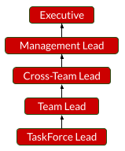

# Parcours de leadership

## Répartition du chemin

Le parcours Leadership met l'accent sur la dynamique des équipes.

_Leadership_ ne doit pas être confondu avec _management_.
L'un concerne _"conduire, guider, être le premier"_, l'autre concerne _"manipuler, toucher, manœuvrer"_.
Cependant, nous avons une étape « Management Lead » dans ce cheminement car _travailler sur les principes sous-jacents aux manœuvres_ (≠ manœuvrer) est une étape avancée.

Les leaders utilisent différentes techniques pour amener une équipe à un certain état ciblé.

Cependant, ils nécessitent toujours les mêmes bases solides pour piloter les équipes :
- Capacité d'écoute et d'empathie
- Capacité à inspirer et à clarifier
- Capacité à se responsabiliser et à contribuer
- Capacité à mettre en place des boucles de rétroaction et d'autres canaux de communication
- Capacité à faire preuve de confiance et d'autorité réconfortante

D'un point de vue opérationnel, les dirigeants vont généralement :
- Déterminer et clarifier les objectifs actuels de l'équipe
- Évaluer et fournir les ressources nécessaires pour atteindre ces
- Obtenir un feedback continu pour ajuster les ressources et/ou les objectifs

## Aperçu

### Présentation des étapes

### Motivateur de déménagement personnalisé

Les dirigeants mettent en œuvre des modèles de collaboration durables régulant la disponibilité des ressources nécessaires pour atteindre des objectifs clairement énoncés.

Ils peuvent grandir dans cette voie en :
- Orchestration des équipes
- S'occuper et inspirer ses coéquipiers
- Clarifier les objectifs et les chemins

## Étapes Détails

### Responsable du groupe de travail

Les TaskForce Leads sont les pionniers des petits groupes.
Ils donnent le plus souvent l'exemple pour accomplir une tâche prédéfinie dans un temps et une portée assez limités.

Les chefs de groupe de travail ont généralement 1 à 2 ans d'expérience.
Ils présentent également les éléments suivants :
- Capacité à montrer l'exemple et à inspirer dans un contexte clairement défini (temps + ressources)
- Capacité à diriger au moins 3 membres de l'équipe
- Capacité à mettre en place de bons modèles de communication au sein d'une équipe
- Capacité à développer le sens de l'appropriation de l'équipe

### Chef d'équipe

Les chefs d'équipe sont des accomplisseurs d'objectifs complexes.
Ils doivent généralement travailler avec une équipe relativement homogène, se concentrant principalement sur l'alignement des ressources et des personnes sur les objectifs.

Les chefs d'équipe ont généralement plus de 5 ans d'expérience.
Ils présentent également les éléments suivants :
- Mettre en place des modes de communication clairs entre les parties prenantes de l'objectif et l'équipe
- Capacité à diriger au moins 5 membres de l'équipe pendant plus de quelques mois
- Capacité à inspirer et à concentrer l'énergie de l'équipe sur un objectif
- Capacité à identifier et mettre en évidence la contribution de chaque membre

### Responsable inter-équipes

Les responsables inter-équipes travaillent dans des relations complexes.
Ils mettent en œuvre la collaboration d'équipes relativement hétérogènes avec des agendas et des domaines d'expertise différents.

Les chefs d'équipe ont généralement plus de 8 ans d'expérience.
Ils présentent également les éléments suivants :
- Mettre en place de bons modèles de communication entre les différentes équipes
- Capacité à adapter l'objectif commun en fonction des équipes
- Capacité d'identifier et de mettre en évidence les forces d'une équipe diversifiée
- Capacité à formaliser les besoins de gestion des connaissances et de transfert de connaissances entre les équipes

### Responsable de la gestion

Les responsables de gestion sont des travailleurs des principes sous-jacents de la dynamique des équipes.
Ils cherchent à concevoir des configurations collaboratives soutenant la culture et les objectifs de l'organisation.

Les responsables de gestion ont généralement plus de 12 ans d'expérience.
Ils présentent également les éléments suivants :
- Excellente communication au sein de leur organisation
- Capacité à formaliser des schémas de collaboration en accord avec les valeurs de l'organisation
- Capacité de conseiller et d'influencer positivement la prise de décision stratégique à tous les niveaux de l'organisation
- Capacité à mettre en œuvre les principes collaboratifs des stratégies d'organisation

### Exécutif

Les cadres sont les chefs des organisations.
Ils conçoivent la culture et les objectifs de l'organisation et facilitent leur mise en œuvre.

Les cadres ont généralement plus de 15 ans d'expérience.
Ils présentent également les éléments suivants :
- Capacité à définir l'ambition et la vision de l'organisation
- Capacité à fixer des objectifs clairs et mesurables à travers l'organisation
- Capacité à définir les stratégies globales pour atteindre les objectifs de l'organisation
- Capacité à superviser et à faciliter l'exécution de stratégies

[🏠Retour](../README_fr.md)
