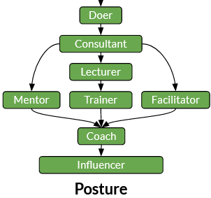

# Posture path

## Path breakdown

The Posture path focuses on conscious behaviours that can positively impact people around us.

_Posture_ might be the most difficult path to explain, as it is largely covered in the literature and the word has so many meanings depending on the authors.
So we first tried to clarify what we call _Posture_ in our context.

_Posture_ is our ability to use different behavioral techniques to bring a team or an individual to a certain targeted state or to reach a pre-defined objective.
Over time, the initial plan or the targeted state often change. But any necessary adaptations can also be made consciously with the right timing.

However, this requires some strong foundation:
- Ability to listen and learn
- Ability to teach and explain
- Ability to empower and contribute
- Ability to summarize and take decisions
- Ability to display confidence and comforting authority

From an operational standpoint, a _posture_ will usually help us to:
- Help individuals, teams or organisations to reach a target
- Get continuous feedback to adjust the posture we use in our operational context

## Overview

The _posture_ will reflect our ability to have the right behavior, to use the rigth tools at the right moment and with the right persons. The objective is to find a good balance between listening, helping and acting ourselves.

### Steps overview

## Steps Details

### Doer

The Doer posture marks the beginning of the path.

Doers are able to:
- Follow a plan, an order, an idea...
- Change course in case something goes wrong
- Inspire action by setting an example

### Consultant

Consultants are at the next level. They have the ability to go beyond simple task execution.

They also showcase the following:
- Ability to communicate clearly with objectives' stakeholders
- Ability to clarify and challenge needs expressions
- Ability to identify bottlenecks before they congest a context
- Ability to propose options or alternatives

From this point onward, there are 3 dictinct paths. They overlap each other to some extent, as helping individuals or groups requires some fundamental techniques.

### Mentor

Mentors help others by listening to them, protecting them, making them avoid being in trouble.
They have what we call a _low posture_.

We can compare them to 'mountain guides', who walk with you, provide you advice, while you are still the owner of the path you choose to follow.
The guides are there to ensure your success, but they are not accountable for it as they do not control the key parts of your success.

As for abilities, Mentors showcase the following:
- Ability to listen and to question
- Ability to keep their personal feelings from affecting the mentee(s)
- Ability to suggest neutral ideas
- Ability to define the rules and the limits of the provided support

### Lecturer and Trainer

Trainers transfer knowledge to trainees.
They have a _high posture_.
However, one must remember that good teachers alternate the _Trainer_ posture with the _Mentor_ one during teaching sessions.

Lecturers can still deliver knowledge, but Trainers also have the ability to build training paths adapted to their students.

Trainers then showcase the following:
- Ability to share, transfer a piece of knowledge
- Ability to construct a learning path adapted to the trainee(s) needs
- Ability to adapt the training to the specificities of the audience

### Facilitator

Facilitators (not limited to "agile facilitators") are persons who have the capability to extract the collective knowledge of an individual or a group to find a solution to a problem.

They also showcase the following:
- Ability to drive a group
- Ability to be solution-focused
- Ability to question
- Ability to summarize and reformulate ideas / opinions

### Coach

Coaches have the ability to consciously use one of the previous postures in order to achieve their goal.

They have the control of their own posture and use it with purpose.
Having a Coach posture requires a deep awareness of internal motivations: what drives us and what can drive a group of people.
Going at this level means we have a deep control of our natural behavior. This may generate stress, tiredness or euphory as the job may be both challenging and exciting.
Warning: burnouts may also happen due to spending too much time on thrilling activities.

The progress in this direction is often guided, as _hypervision_ (progression with peers) or _supervision_ (progression with a mentor) are key enablers of this role.

As for abilities, Coaches showcase the following:
- Ability to adopt (in real-time) the most suitable posture to reach an objective
- Ability to explain a situation
- Ability to find a set of solutions to a problem
- Ability to ask for help when needed
- Ability to take care of themselves

### Influencer

As seen with the previous steps, we value the abilities enabling the positive change of behaviours or capabilities of the people around us. So, in our path, the ability to share, promote a piece of knowledge or a practice, with a deep analysis on how it works and why, has a significant impact.

To that end, Influencers should master:
- the _logos_ (the logical part of the message, we make sense by leveraging the most relevant arguments)
- the _ethos_ (the messenger's credibility, we must be confident and honorable)
- the _pathos_ (the emotional part of the message, we have an emotional impact on the listeners)

Beginners may focus on only one aspect of message communication, but these three parts are equally important.

Moreover, Influencers also showcase the following:
- Ability to engage people in a path, a change or a transformation
- Ability to share and explain their firm beliefs
- Ability to naturally reach consensuses on certain matters

[🏠Go Back](../README.md)
