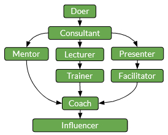

# Chemin de posture

## Répartition du chemin

Le chemin Posture se concentre sur les comportements conscients qui peuvent avoir un impact positif sur les gens qui nous entourent.

_Posture_ pourrait être le chemin le plus difficile à expliquer, car il est largement couvert dans la littérature et le mot a tellement de sens selon les auteurs.
Nous avons donc d'abord essayé de clarifier ce que nous appelons _Posture_ dans notre contexte.

_Posture_ est notre capacité à utiliser différentes techniques comportementales pour amener une équipe ou un individu à un certain état ciblé ou pour atteindre un objectif prédéfini.
Au fil du temps, le plan initial ou l'état visé changent souvent. Mais toutes les adaptations nécessaires peuvent également être faites consciemment avec le bon timing.

Cependant, cela nécessite des bases solides :
- Capacité d'écoute et d'apprentissage
- Capacité à enseigner et à expliquer
- Capacité à se responsabiliser et à contribuer
- Capacité de synthèse et de prise de décision
- Capacité à faire preuve de confiance et d'autorité réconfortante

D'un point de vue opérationnel, une _posture_ nous aidera généralement à :
- Aider des individus, des équipes ou des organisations à atteindre une cible
- Obtenir un feedback continu pour ajuster la posture que nous utilisons dans notre contexte opérationnel

## Aperçu

La _posture_ reflétera notre capacité à avoir le bon comportement, à utiliser les bons outils au bon moment et avec les bonnes personnes. L'objectif est de trouver un bon équilibre entre écouter, aider et agir soi-même.

### Présentation des étapes

## Étapes Détails

### Acteur

La posture du Doer marque le début du chemin.

Les pratiquants sont capables de :
- Suivre un plan, une commande, une idée...
- Changer de cap en cas de problème
- Inspirer l'action en donnant l'exemple

### Conseillère

Les consultants sont au niveau supérieur. Ils ont la capacité d'aller au-delà de la simple exécution de tâches.

Ils présentent également les éléments suivants :
- Capacité à communiquer clairement avec les parties prenantes des objectifs
- Capacité à clarifier et à remettre en question les expressions de besoins
- Capacité à identifier les goulots d'étranglement avant qu'ils n'engorgent un contexte
- Capacité à proposer des options ou alternatives

A partir de ce point, il y a 3 chemins distincts. Ils se chevauchent dans une certaine mesure, car aider des individus ou des groupes nécessite des techniques fondamentales.

### Mentor

Les mentors aident les autres en les écoutant, en les protégeant, en leur évitant d'avoir des ennuis.
Ils ont ce que nous appelons une _bas posture_.

On peut les comparer à des « guides de montagne », qui marchent avec vous, vous conseillent, alors que vous êtes toujours propriétaire du chemin que vous choisissez de suivre.
Les guides sont là pour assurer votre succès, mais ils n'en sont pas responsables car ils ne contrôlent pas les éléments clés de votre succès.

En ce qui concerne les capacités, les mentors présentent les éléments suivants :
- Capacité d'écoute et de questionnement
- Capacité à empêcher que leurs sentiments personnels n'affectent le(s) mentoré(s)
- Capacité à proposer des idées neutres
- Capacité à définir les règles et les limites de l'accompagnement fourni

### Conférencier et Formateur

Les formateurs transmettent les connaissances aux stagiaires.
Ils ont une _haute posture_.
Cependant, il ne faut pas oublier que les bons enseignants alternent la posture du _Formateur_ avec celle du _Mentor_ lors des séances d'enseignement.

Les enseignants peuvent toujours transmettre des connaissances, mais les formateurs ont également la possibilité de construire des parcours de formation adaptés à leurs étudiants.

Les formateurs présentent ensuite les éléments suivants :
- Capacité à partager, transférer un savoir
- Capacité à construire un parcours d'apprentissage adapté aux besoins du/des stagiaire(s)
- Capacité à adapter la formation aux spécificités du public

### Facilitateur

Les facilitateurs (non limités aux « facilitateurs agiles ») sont des personnes qui ont la capacité d'extraire les connaissances collectives d'un individu ou d'un groupe pour trouver une solution à un problème.

Ils présentent également les éléments suivants :
- Capacité à conduire un groupe
- Capacité à être axé sur les solutions
- Capacité de questionner
- Capacité à résumer et à reformuler des idées/opinions

### Entraîneur

Les entraîneurs ont la capacité d'utiliser consciemment l'une des postures précédentes afin d'atteindre leur objectif.

Ils ont le contrôle de leur propre posture et l'utilisent à bon escient.
Avoir une posture de Coach nécessite une profonde conscience des motivations internes : ce qui nous anime et ce qui peut conduire un groupe de personnes.
Aller à ce niveau signifie que nous avons un contrôle profond de notre comportement naturel. Cela peut générer du stress, de la fatigue ou de l'euphorie, car le travail peut être à la fois stimulant et passionnant.
Attention : des burn-outs peuvent également survenir en raison de passer trop de temps sur des activités passionnantes.

La progression dans cette direction est souvent guidée, car l'_hypervision_ (progression avec les pairs) ou la _supervision_ (progression avec un mentor) sont des catalyseurs clés de ce rôle.

En ce qui concerne les capacités, les entraîneurs présentent les éléments suivants :
- Capacité à adopter (en temps réel) la posture la plus adaptée pour atteindre un objectif
- Capacité à expliquer une situation
- Capacité à trouver un ensemble de solutions à un problème
- Capacité à demander de l'aide en cas de besoin
- Capacité à prendre soin d'eux-mêmes

### Influenceur

Comme vu avec les étapes précédentes, nous valorisons les capacités permettant le changement positif de comportements ou de capabilités des gens qui nous entourent. Ainsi, sur notre chemin, la capacité de partager, de promouvoir un savoir ou une pratique, avec une analyse approfondie de son fonctionnement et de son pourquoi, a un impact significatif.

Pour cela, les Influenceurs doivent maîtriser :
- les _logos_ (la partie logique du message, on fait sens en s'appuyant sur les arguments les plus pertinents)
- l'_ethos_ (crédibilité du messager, il faut être confiant et honorable)
- le _pathos_ (la partie émotionnelle du message, nous avons un impact émotionnel sur les auditeurs)

Les débutants peuvent se concentrer sur un seul aspect de la communication du message, mais ces trois parties sont tout aussi importantes.

De plus, les influenceurs présentent également les éléments suivants :
- Capacité à engager les gens dans un chemin, un changement ou une transformation
- Capacité à partager et à expliquer ses convictions
- Capacité à parvenir naturellement à des consensus sur certains sujets

[🏠Retour](../README_fr.md)
