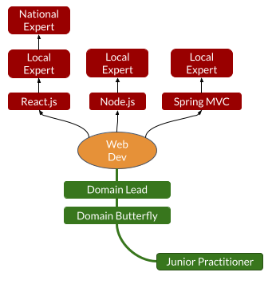
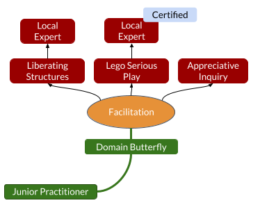
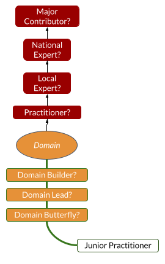

# Practices & related Domains path

## Path breakdown and representation

When it comes to making an impact through your Functional Skills, we have settled for 2 directions to grow at the same time:
- Through __Techniques__ mastery => __Practice Expertise__
- Through __Knowledge__ development => __Domain Expertise__

In the framework, we group Practices per Domain.

You may represent each Domain as a growing flower:
- The length of the stem gives you the first level of impact through the overall Domain knowledge.
- The length of each petal gives you the level of impact for each specific Practice.

For example:
- A Front-End Developer could specialize in __React__, __Node.js__ and __Spring MVC__ within the __Web Development__ domain and position themselves as a __Domain Lead__ on that particular domain:

- An Agile Coach could specialize in __Liberating Structures__, __Lego Serious Play__ and __Appreciative Inquiry__ within the __Facilitation__ domain and position themselves as __Domain Butterfly__ on that particular domain:

The __Practices and related Domains__ path is the only one that can spawn multiple "sub-paths" and this is the reason why we are modeling it differently than the more linear others.

Practices are completely dependant of the Domain of expertise of each collaborator.

We wanted the manipulated terms to be as generic as possible to make them applicable to both Zenika front-office and back-office staff.

## Overview

### Steps overview

### Practice Specialist

Practice Specialists use hard-earned experience and accurate insight to maximize their impact when putting their skills to work.

They can grow in this path by:
- Studying edge-case applications
- Polishing their skills solving real-life issues
- Exploring the Practices internals

### Domain Expert

Domain Experts use domain knowledge to maximize their impact in a contoured field.

They can grow in this path by:
- Keeping up with trends of the Domain
- Applying their domain knowledge for solutioning
- Diversifying their field experience

## Steps Details

### Junior Practitioner

This is the starting point for everyone's career with our first job.
We all start by doing one thing first, learning and producing results with that very first practice.
But Junior Practitioners are not really specialized yet and are thus not necessarily working in a specific Domain.

Junior Practitioners usually have 0 to 1 year of experience for a given Practice.
They also showcase the following:
- Good logical thinking
- Fast learners
- Autonomous for well-specified tasks
- Good communication on their work
- Able to reach out for help and clarify their needs

### Practitioner

Practitioners are specialists of a given Practice and are able to achieve results with little guidance.
They use some aspects of the Practice on a regular basis.

Practitioners usually have 1 to 3+ years of experience for a given Practice.
They also showcase the following:
- Specialist on at least one meaningful aspect of the practice
- Responsible for their own production
- Ability to guide junior practitioners
- Ability to evaluate certain performance aspects of the practice
- Ability to review work using the practice and provide constructive feedback

### Local Expert

Local Experts are recognized locally for their concrete relevant experience in a given practice.
They have a robust knowledge of the Practice, hardened through local community sharing sessions.

Local Experts usually have 3+ years of experience for a given Practice.
They also showcase the following:
- Knowledgeable on all aspects of the practice
  - e.g. for a Software Framework: Development, deployment and maintenance of complex softwares built on the Framework
  - e.g. for an Organizational Methodology: Building, deployment and governance of organizational setups
- Recognized in a local agency / region / group of customers as an expert (e.g. through assignments, talks, meetups, conferences…)
- Ability to lead complex production work using the practice

### National Expert

National Experts are recognized nationally for their outstanding experience in a given practice.
They have a 1st-class knowledge of the Practice, hardened through national community sharing sessions.

National Experts usually have 5+ years of experience for a given Practice.
They also showcase the following:
- Recognized and/or certified for their work using the practice
- Natural practice lead
- Recognized nationally / at the organization level as an expert
- Ability to lead critical production work using the practice

### Major Contributor

Major Contributors are recognized for their contribution to a given practice.
They have a publicly available track record of making an impact on the practice usages or internals.

Major Contributors usually have 10+ years of experience for a given Practice.
They also showcase the following:
- Affected the practice usage landscape
- Contributed to a key feature/concept used at a global scale
- Considered one of the main references on a specific practice aspect, with global recognition

### Domain Butterfly

Domain Butterflies know about different practices of a given Domain by having some experience with a few of them.
They start having a good overview of the different existing approaches in the Domain.

Domain Butterflies usually have 2 to 5 years of experience in a certain Domain.
They also showcase the following:
- Ability to identify the key common concepts across a given domain
- Ability to suggest multiple practices options with pros&cons within a given domain
- Ability to apply domain knowledge to production work
- Ability to propose some alternatives to achieve domain goals

### Domain Lead

Domain Leads know about most practices of a given Domain by having a solid experience with a many.
They can share a clear insight on the best practices related to the Domain.

Domain Leads usually have 5+ years of experience in a certain Domain.
They also showcase the following:
- Recognized and/or certified for at least one specific domain practice
- Successfully implemented solutions with a variety of practices belonging to the domain
- Ability to optimize the use of practices for the domain
- Ability to adjust or enhance some domain practices
- Ability to consider most options to achieve domain goals

### Domain Builder

Domain Builders are experts of a given Domain and have started contributing to its development.
They contribute to the innovative practices that will constitute the Domain in the future.

Domain Builders usually have 10+ years of experience in a certain Domain.
They also showcase the following:
- Recognized and/or certified in the use of multiple domain practices
- Contributed to the set of practices elevating the domain
- Public availability of their work or proof of work

[🏠Go Back](../README.md)